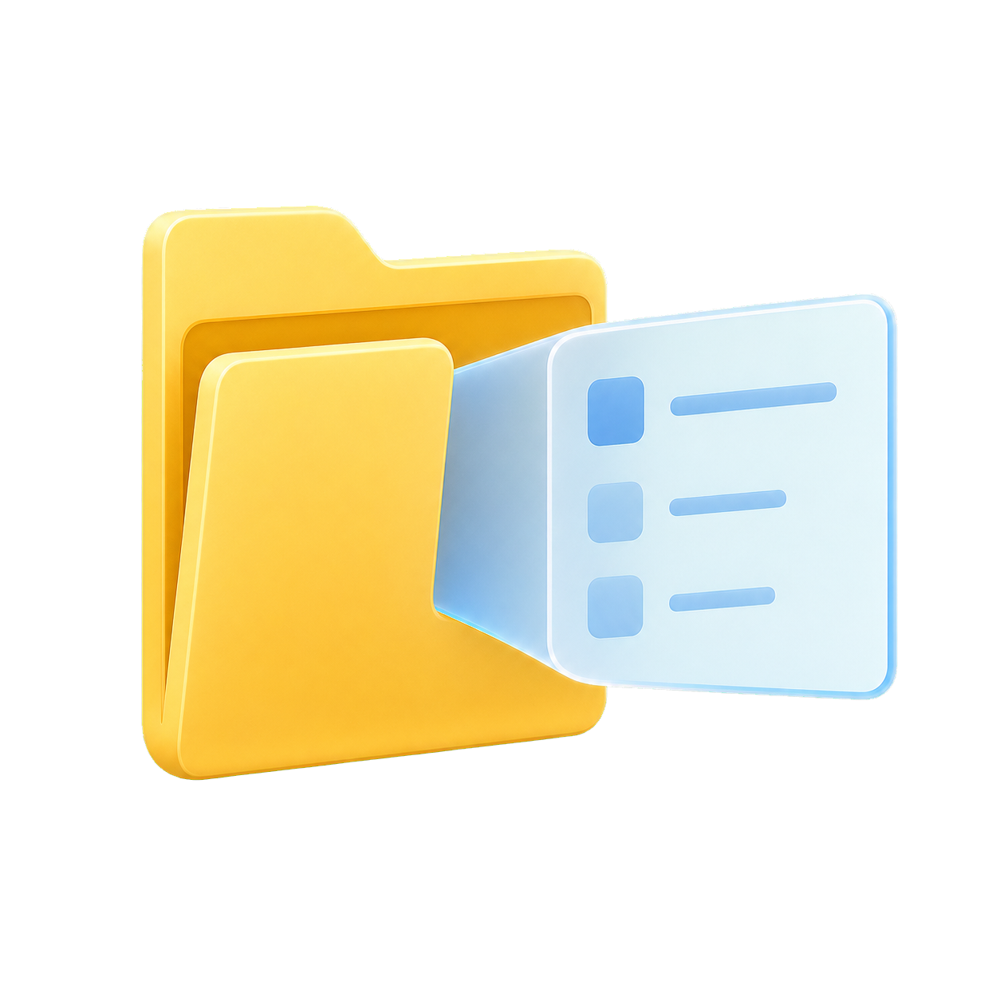
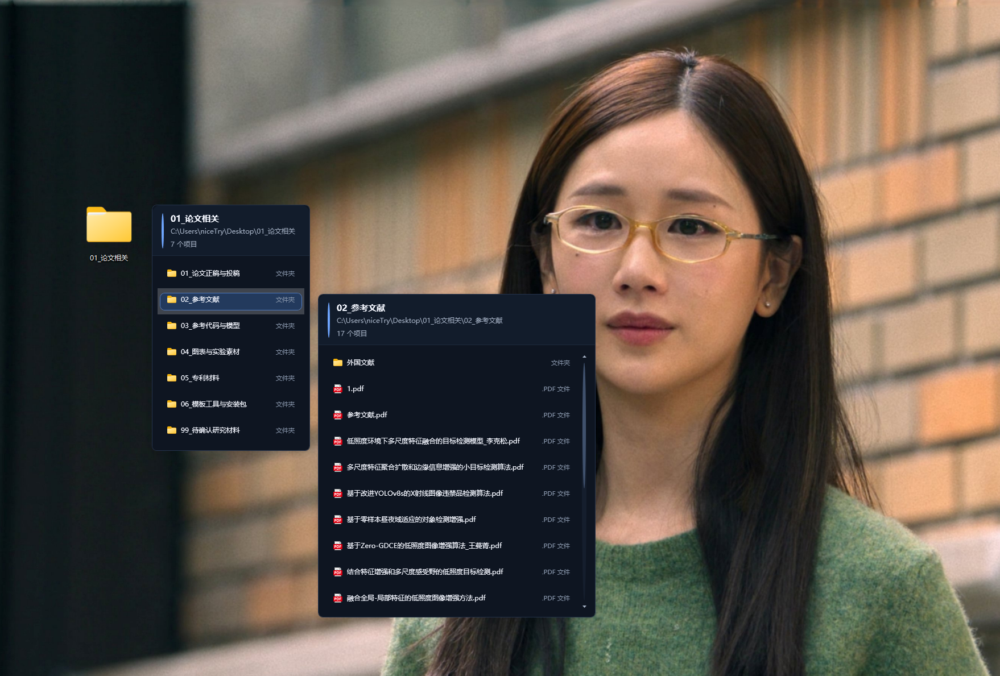
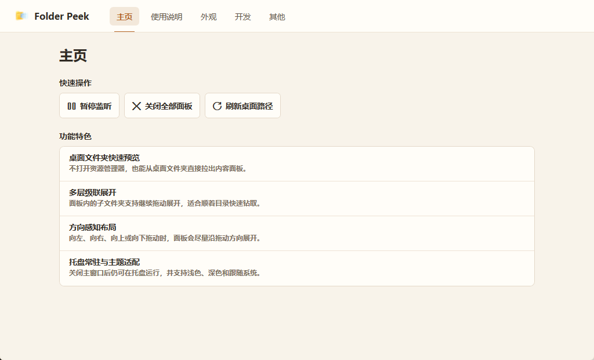
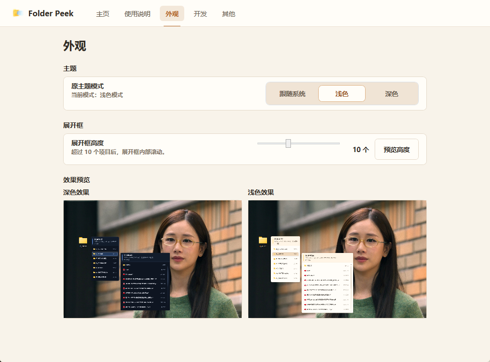
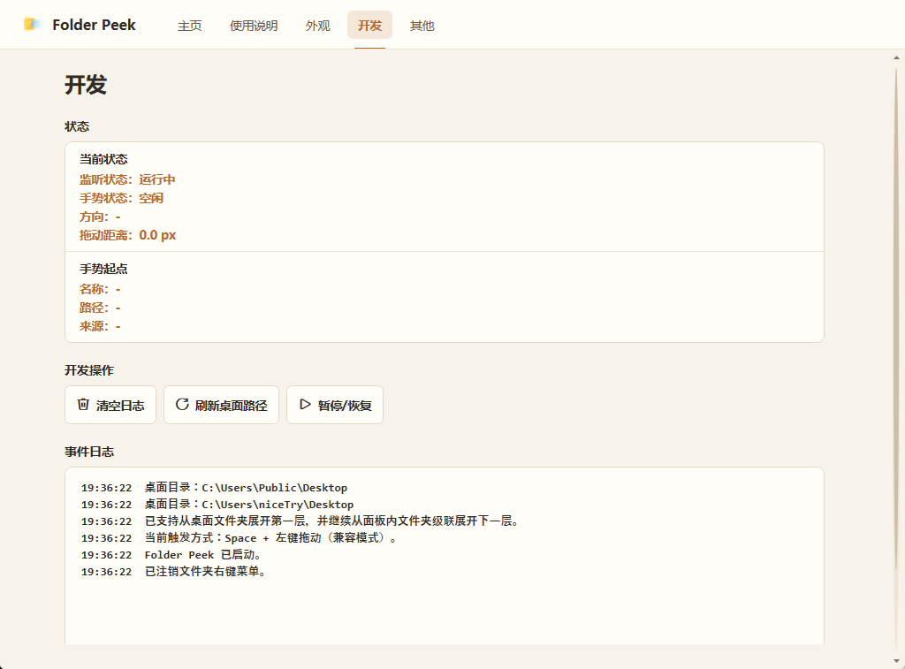
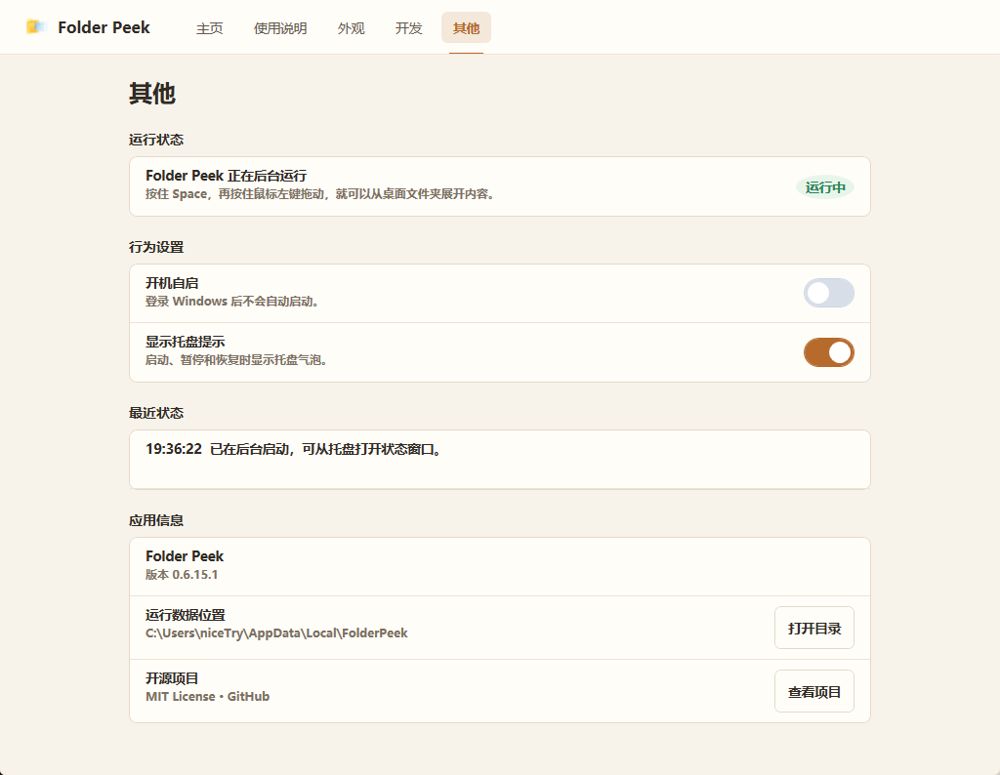
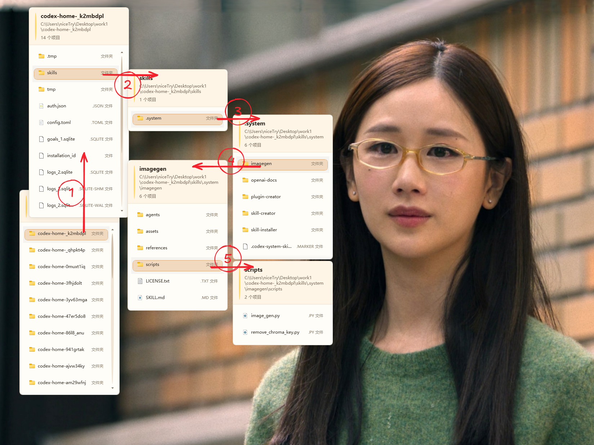
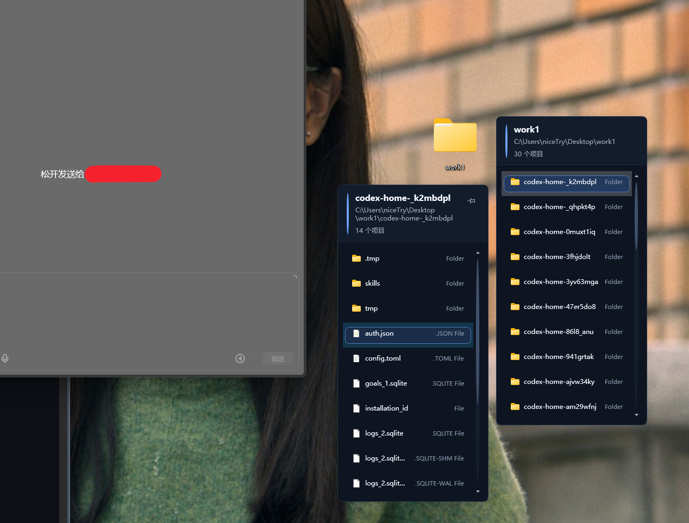
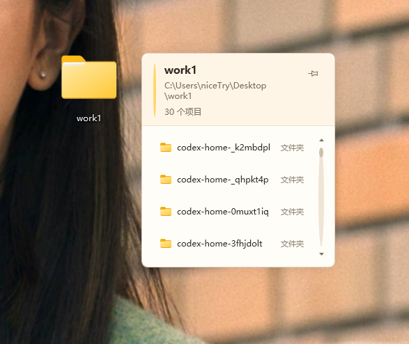
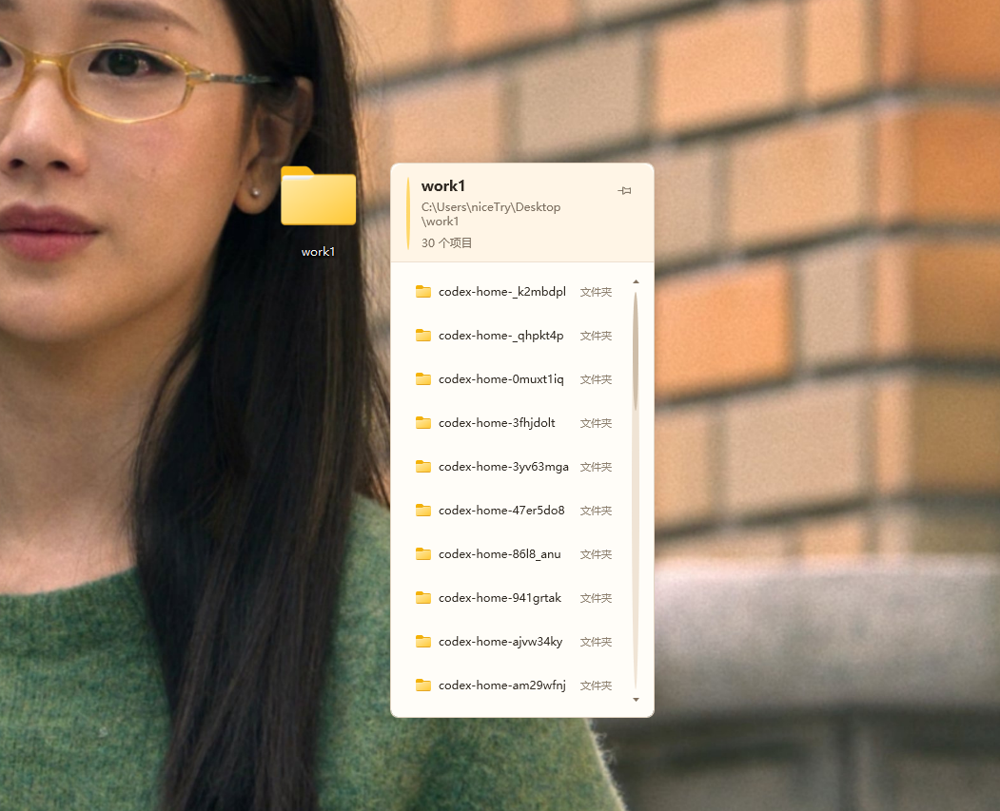

# Folder Peek



> 从桌面文件夹向外一拖，内容就在旁边展开。

Folder Peek 是一个面向 Windows 桌面的开源小工具。它想解决一个很具体的问题：很多时候，你只是想从桌面某个文件夹里“顺手拿一个文件”，但双击打开资源管理器、切窗口、再回到当前工作流，动作还是有点重。

这个项目的思路是：不给资源管理器做替代品，而是给桌面文件夹加一个临时展开层。你在桌面文件夹上做一个手势，它就在旁边弹出内容面板；点到文件后，系统直接用默认程序打开，面板随即收起。

## 目录

- [它能做什么](#它能做什么)
- [实际效果](#实际效果)
- [当前状态](#当前状态)
- [展开方式](#展开方式)
- [使用方式](#使用方式)
- [适用平台](#适用平台)
- [当前支持范围](#当前支持范围)
- [作者建议使用人群](#作者建议使用人群)
- [快速开始](#快速开始)
- [界面预览](#界面预览)
- [特色功能展示](#特色功能展示)
- [为什么做这个项目](#为什么做这个项目)
- [技术栈](#技术栈)
- [项目结构](#项目结构)
- [Roadmap](#roadmap)
- [参与贡献](#参与贡献)
- [已知限制](#已知限制)
- [License](#license)
- [想对社区说的话](#想对社区说的话)

## 它能做什么

- 从桌面普通文件夹直接展开内容面板
- 支持向左、向右、向上、向下四个方向展开
- 支持对子文件夹继续展开，形成多级级联面板
- 支持默认手势和 4 种可保存的可选展开方式
- 支持三态图钉、多个钉住窗口并存和独立拖动
- 单击文件后用系统默认程序打开
- 未钉住窗口在打开文件后自动关闭
- 支持 `Esc` 关闭、点击外部关闭；已钉住窗口会继续保留
- 支持托盘常驻、暂停监听、关闭全部面板
- 支持浅色 / 深色 / 跟随系统
- 支持开机自启、托盘提示、展开面板高度等基础设置

## 实际效果




## 当前状态

**这是一个已经能用的原型，但还在持续打磨。**

主链路已经跑通：托盘运行、桌面命中、内容读取、级联展开、文件打开、面板关闭，这些都已经有实现。

不过它现在仍然是偏“开源原型”的状态，离一个完全收尾的正式版本还有一些距离，尤其是在下面这些地方：

- 触发手势还在迭代
- 桌面命中范围目前聚焦普通文件夹
- 特殊 Shell 项和更复杂的文件管理能力还没做

## 展开方式

默认手势仍然是：**按住 `Space`，再按住鼠标左键向任意方向拖动**。它不需要额外设置，适合希望稳定、明确触发的人。

在“使用说明”页可以选择并保存另外 4 种展开方式：

- `中键拖动`：支持首层和级联面板展开；快速拖放时也会保留最后一次移动，避免漏掉级联触发。
- `融合进右键菜单`：在文件夹的“显示更多选项”中选择“使用 Folder Peek 展开”；已运行实例会接收并展开对应路径。
- `长按左键`：在桌面文件夹上静止按住左键 `500ms` 后立即展开。
- `长按右键`：在桌面文件夹上静止按住右键 `500ms` 后立即展开。

长按模式下，级联面板只接受短左键单击展开子文件夹，避免长按带来误触。使用说明顶部的手势图可以点击恢复默认手势；启用可选方式时，这张图会暗化并模糊，用来提示当前不在默认模式。

## 使用方式

1. 启动应用，程序会常驻系统托盘。
2. 在桌面普通文件夹上按住 `Space`。
3. 保持 `Space` 不放，再按住鼠标左键向任意方向拖动。
4. 超过阈值后，Folder Peek 会在对应方向展开文件夹内容。
5. 如果里面还有子文件夹，可以继续用同样的方式拖出下一层。
6. 单击文件，系统会用默认程序打开它；未钉住窗口会自动收起，已钉住窗口会继续保留。

也可以在“使用说明”中切换到中键拖动、右键菜单、长按左键或长按右键；所选方式会自动保存。

关闭方式：

- `Esc`
- 点击面板外部
- 托盘菜单里的“关闭全部面板”
- 暂停监听或退出应用

## 适用平台

- Windows 10
- Windows 11
- .NET 8

## 当前支持范围

已支持：

- 用户桌面和公共桌面中的普通文件夹
- 多级级联展开
- 默认 `Space + 左键拖动`，以及中键拖动、右键菜单、长按左键、长按右键
- 展开方式持久化；可随时点击使用说明顶部图片恢复默认手势
- 三态图钉、多个钉住窗口并存、独立保留窗标题区拖动
- 从面板直接把文件拖到聊天框、编辑器等外部目标
- 隐藏文件 / 系统文件过滤
- 面板展开与关闭动画
- 托盘常驻和基础设置持久化

暂未支持：

- 特殊 Shell 项，如“此电脑”“回收站”“控制面板”
- `.lnk` 指向文件夹
- 面板内文件管理操作，如重命名、删除、复制、剪切、粘贴
- 搜索
- 缩略图预览
- 独立的 Win11 主题风格体系

## 作者建议使用人群

我自己更推荐下面这两类人来用 Folder Peek：

- 桌面上本来就喜欢堆很多文件夹的人
- 桌面文件很多、很乱，但愿意先整理成“按主题分文件夹”这种用法的人

第二类用户其实也很适合：可以先借助 AI 或你自己习惯的整理方式，把桌面文件按你喜欢的结构收成一批顺手可用的文件夹，然后再配合 Folder Peek 来快速展开和取用。

## 快速开始

目前已经有整理好的发布压缩包，用户可以直接下载并解压使用。

### 直接使用发布包

1. 从 GitHub Releases 下载 `FolderPeek-v0.6.16-click-folder-expand-win-x64.zip`
2. 解压压缩包
3. 运行里面的 `FolderPeek.App.exe`

注意：

- 当前发布包是 `win-x64` 的 framework-dependent 版本
- 运行前需要系统已安装 **.NET 8 Desktop Runtime**
- 运行后的设置、主题和索引缓存会写入 `%LocalAppData%\FolderPeek`，不会污染发布目录

如果你想自己从源码运行，也可以按下面方式启动。

### 1. 克隆仓库

```powershell
git clone <your-repo-url>
cd <repo-folder>
```

### 2. 构建

```powershell
dotnet build .\FolderPeek.sln
```

### 3. 运行

```powershell
dotnet run --project .\FolderPeek.App\FolderPeek.App.csproj
```

运行后应用会驻留在系统托盘中。

### 4. 整理发布包

```powershell
powershell -ExecutionPolicy Bypass -File .\scripts\publish.ps1
```

默认会：

- 从 `FolderPeek.App.csproj` 读取当前版本号
- 发布到 `output/staging/<package-name>`
- 生成 zip 到 `output/release/<package-name>.zip`

如果需要 self-contained 版本：

```powershell
powershell -ExecutionPolicy Bypass -File .\scripts\publish.ps1 -SelfContained
```

正式发版前，建议按 [docs/release-checklist.md](./docs/release-checklist.md) 逐项核对一次版本号、README 和发布产物。

## 界面预览

### 主页



### 使用说明


### 外观



### 开发页



### 其他



## 特色功能展示

### 多级多向展开



### 从面板直接拖出文件



### 自定义不同展开高度





## 为什么做这个项目

这个项目并不打算替代资源管理器。

它更像是给“桌面上的文件夹”补一个轻量操作层，适合这些场景：

- 临时从某个桌面资料夹里拿文件
- 顺着一两层目录快速钻取
- 不想反复开关资源管理器窗口
- 想保留当前工作焦点，只做一次很轻的文件取用

如果你也觉得“桌面文件夹本来就应该能被更快地顺手展开一下”，那我们大概在想的是同一件事。

## 技术栈

- C#
- WPF
- .NET 8
- Win32 API
- Shell / UI Automation

## 项目结构

```text
Folder Peek
├─ docs/screenshots/            # README 截图与界面预览
├─ docs/release-checklist.md    # 小型发版清单
├─ FolderPeek.sln
├─ FolderPeek.App/
│  ├─ PrototypeCoordinator.cs   # 手势总控、托盘事件、主链路协调
│  ├─ PanelManager.cs           # 级联面板创建、定位、关闭
│  ├─ FolderPanelWindow.xaml    # 面板 UI
│  ├─ DesktopItemResolver.cs    # 桌面命中解析
│  ├─ FolderContentProvider.cs  # 文件夹内容读取
│  ├─ GlobalMouseHook.cs        # 全局鼠标钩子
│  ├─ GlobalKeyboardHook.cs     # 全局键盘钩子
│  ├─ AppThemeService.cs        # 主题系统
│  ├─ AppSettingsService.cs     # 设置持久化
│  └─ TrayIconService.cs        # 托盘菜单与状态
├─ scripts/
│  └─ publish.ps1               # 发布到 staging/release 的脚本
└─ output/imagegen/             # 图标相关产物
```

## Roadmap

- [ ] 继续提升桌面命中稳定性
- [ ] 完善级联展开的边界行为和错误提示
- [ ] 支持 `.lnk` 指向文件夹
- [ ] 探索搜索、缩略图和更多文件管理操作
- [ ] 希望社区一起补上高完成度的 Win11 风格主题

## 参与贡献

欢迎 issue、讨论和 PR，尤其是下面这些方向：

- 桌面图标命中与 Shell 解析
- 更自然的手势设计
- 多屏 / 高 DPI 场景适配
- WPF 面板交互和视觉打磨
- Windows 桌面工作流相关的产品建议
- Win11 风格视觉实现与资源整理

如果你准备改代码，建议先看这几个文件：

- [PrototypeCoordinator.cs](./FolderPeek.App/PrototypeCoordinator.cs)
- [PanelManager.cs](./FolderPeek.App/PanelManager.cs)
- [DesktopItemResolver.cs](./FolderPeek.App/DesktopItemResolver.cs)
- [MainWindow.xaml](./FolderPeek.App/MainWindow.xaml)

## 已知限制

- 当前只重点支持桌面普通文件夹
- 手势方案仍是过渡实现
- 还没有安装包与自动更新流程

## License

[MIT](./LICENSE)

## 想对社区说的话

这个项目现在更像是“功能主链路已经搭好，但外观和细节还有不少提升空间”的状态。

有两件事我想明确说一下：

- 默认手势仍然是 `Space + 左键拖动`；中键、右键菜单和长按方式已经作为可选方案提供，后续会继续根据实际反馈打磨
- Win11 风格我自己已经尝试过，但以我目前的能力还没把它做到满意

所以如果你刚好擅长下面这些方向，我会非常欢迎你的帮助：

- 更成熟的 Windows 11 风格视觉重构
- WPF 主题资源整理和组件状态统一
- 更细腻的面板动画、阴影、材质和交互反馈

## 致谢

这个项目最早来自一个很朴素的想法：

> 桌面文件夹不该只能“双击打开”，它也可以“顺手展开一下”。

如果你对这个方向感兴趣，欢迎把它一起打磨成一个真正好用的 Windows 小工具。
